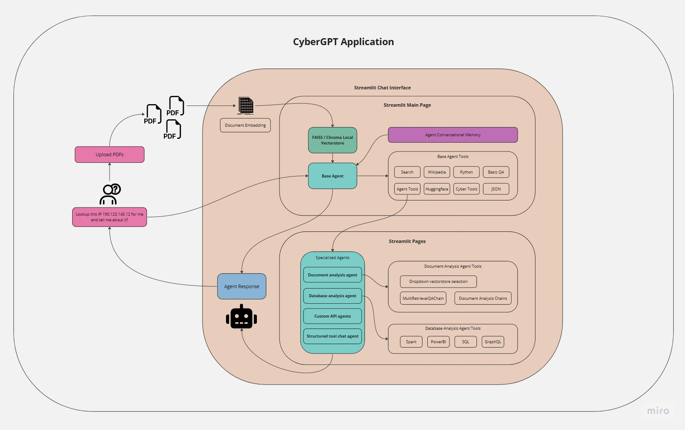
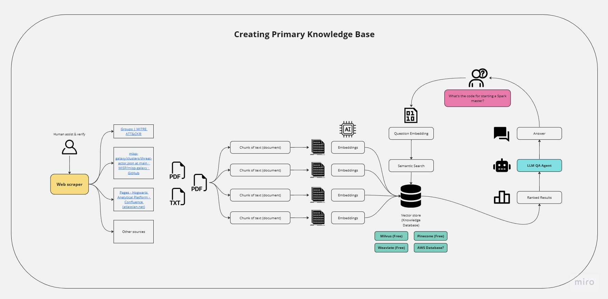

# CyberGPT
Cybersecurity specialized AI application.

## Introduction

Large Language Models (LLMs) can be integrated into cybersecurity services to provide better user interfaces and analysis help for security analysts.  Team 5.2 proposes to create an application similar to ChatGPT but enhanced with cybersecurity knowledge and tools, named CyberGPT.  The project's primary focus is to extract contextual knowledge from various organizational sources, including research documents and information, as well as open source API endpoints, to create an effective AI assistant for cybersecurity analysts. Additionally, the project will demonstrate CyberGPT's capabilities in performing actions such as IP or MD5 lookup by calling the relevant custom built tools, conducting web searches for latest cybersecurity research, conducting analysis with question answering on databases, among other useful features. The project will leverage specialized cybersecurity tools and foundational LLM models to achieve its goals. Ultimately, the project seeks to develop an artificial general intelligence that can automate analysts' tasks and reasoning procedures, while streamlining the cybersecurity analysis process through the capabilities of generative AI.

### Objectives

Team 5.2 aims to create the minimal viable product of CyberGPT, demonstrating the uses of generative artifical intelligence in cybersecurity.  

- Designing specialized AI agents
  - Selecting the appropriate foundational LLM to be used as the base of the agents and integrating the LLM into the agents.  
  - Creating the code for the custom and noncustom agents, configuring initial prompt and type of agent.
  - Create agent that specializes in database analysis.
  - Create agent that specializes in API tool calls.
  - Create agent that specializes in question answering over documents.
  - Create agent that specializes in question answering through web crawling.
- Designing the memory
  - Create the vector DB setup for storing agent memories.
  - Research into ways of implemntating long term entity memory for agents using vector DB.
- Designing the knowledge bases
  - Determine documents that could/should be part of agent knowledge base.
  - Store relevant documentation into vector DB and connect access to agents.
- Designing the custom toolkits
  - Create the custom tools using Langchain for cybersecurity APIs.
  - Connect tools to agents.
- Designing the application interface
  - Create the application interface using Streamlit or React.
  - Create the configuration settings on the application interface (Agent selection).
  - Create a basic chat interface for interactions between user and AI.

### Expected Results

The expected results for Team 5.2 are:

- The creation of a MVP for project CyberGPT.
- A greater understanding of the potential of generative AI in the cybersecurity space.
- A foundational understanding of how to build custom AI assistants.

### Anticipated Impact

The potential impacts resulting from this work include:

- Knowledge Management: CyberGPT can help organizations better manage and share cybersecurity knowledge and best practices. The tool can be used to capture knowledge and insights from experienced analysts and then share that information with new analysts and other stakeholders.

- Increased Accuracy: By leveraging specialized cybersecurity tools and foundational LLM models, CyberGPT will be able to provide more accurate analysis and insights to analysts. This will help them make better decisions and take appropriate actions.

- Enhanced Security: CyberGPT will provide cybersecurity analysts with a powerful tool to help them stay ahead of emerging threats and vulnerabilities. This will ultimately enhance the security of organizations and their data by enabling them to identify and mitigate potential risks more effectively.

In addition, the project could lead to further innovation in the field of cybersecurity by demonstrating the power and potential of generative AI.

## Architectural Diagrams

## Dependencies & Installation

To install the CyberGPT App, please follow these steps:

1. Clone the repository to your local machine.

2. Install the required dependencies by running the following command:

  `pip install -r requirements.txt`

3. Update any additional API keys in the .env file in the project directory.

## Usage

To use the CyberGPT App, follow these steps:

1. Ensure that you have installed the required dependencies and added the necessary API keys to the .env file.

2. Run the app.py file using the Streamlit CLI. Execute the following command:

`streamlit run CyberGPT.py`

3. The application will launch in your default web browser, displaying the user interface.

4. Load any PDF documents into the app by following the provided instructions.

5. Ask questions in natural language about the loaded PDFs using the chat interface.

## Contributing

This repository is intended for participants of GeekWeek Team 5.2 only and does not accept further contributions. It serves as the base CyberGPT application starting point.
