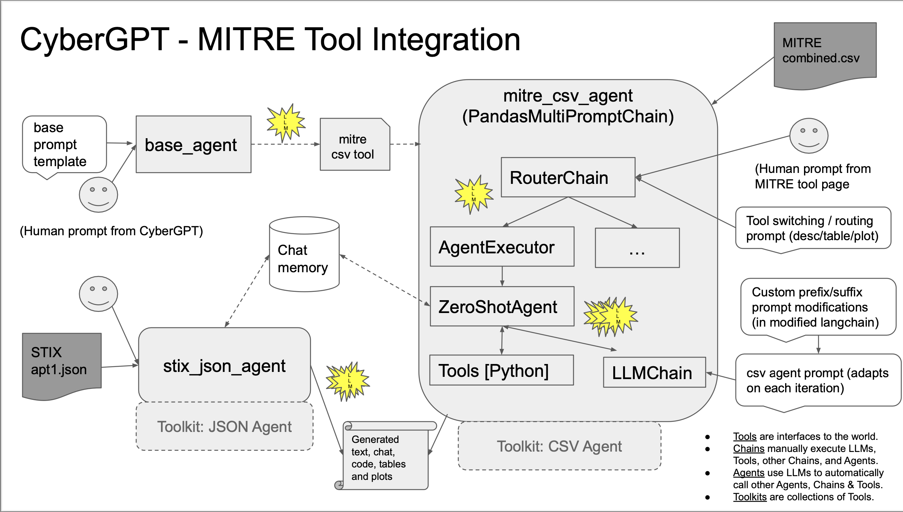

# Mitre CSV

## Introduction

The mitre csv tool is a specialized version of the csv agent, with added ability to switch between relevant prompts that operates on data from the MITRE attack framework (Techiques, Malware Groups, Malware Software, and Mitigations for specific techniques).  It can provide descriptions of the data, produce table summaries, and also generate plots based on the data.


## Set up

To use the tool, you need to have the `combined.csv` file stored in the `data/` directory.  You can download this file from the s3 bucket manual or automatically.  The code will try to do this automatically, but you must set up a connection to the key via:

```
pip install aws
aws configure
```

To download it manually, navigate to the Geekweek applications portal, click on the aws tab, and then search for `s3` in the search bar.  Then, look team5.2-mitre bucket and download the `combined.csv` file.

### Recreating the file manually

To replicate the file with more recent MITRE data, you can use the scripts here: https://github.com/mitre-attack/attack-scripts/tree/master

Navigate to the scripts directory and generate the individual data files with:

```
cd scripts
python technique_mappings_to_csv.py -d enterprise_attack -m groups
python technique_mappings_to_csv.py -d enterprise_attack -m mitigations
python technique_mappings_to_csv.py -d enterprise_attack -m software
```

The commented out code in this repo from `agents/csv_agent.csv` performed the join that puts all the files produced by these commands into a single `combined.csv` file.


## Detailed Notes on Design and Takeaways

If you would like to see this content in slide format, please refer to the CyberGPTDocumentation.pdf.

### Architecture



The current architecture uses a modified version of the csv agent, in order to create custom prompts and also allow switching between different kinds of prompts while running.  The modified code from the underlying langchain is stored under `agents/modified_langchain`.

To implement this, I created a subclass `PandasMultiPromptChain` from `MultiRouteChain`, so that I could change the LLMChain that it uses in it's destination chain object with a Chain object passed through the parameters (AgentExecutor in our case).  

Then, modified much of the prompt construction code invoked from `create_pandas_dataframe_agent` in `modified_langchain/pandas/base.py` and added new prompt templates in `modified_langchain/pandas/prompt.py`.  There are now 3 routes supported at once `description` (also the default), `code_table`, and `code_plot` through the RouterChain.  The first tries to replicate baseline csv agent behavior, answering with descriptions, etc.  The second tries to make the agent respond by producing a formatted table, and the third tries to make it return code to a plot called `fig`.  This was implemented and tested only for data sources from a single csv. I partially modified the multi csv functions as well, but they were not tested at all and are still incomplete.  For examples of how the prompts are constructed, refer to the `_get_single_prompt_template` function.

For plotting, we take the code produced by the agent and use the function `check_if_display_plot` in `utilities/plotting.py`.  This will performance a basic test to see if the returned code can be parsed by the python interpreter, and then saves it into numbered temporary python files `tmp_plt{i}.py`.  Each of these files contains a function `plot_code` that can then be imported, run, and dump the file to streamlit.  The index refers to it's location in the streamlit history, to support multiple plots being loaded in one chat.  This solution is pretty hacky, and I tried several other versions, but all other ones rather into issues with how python handles imports. 

I also modified the arguments to pass in the `handle_parsing_errors` argument so the agent is more robust.  Refer to the later sections of the document for more details.

Finally, I tried implementing memory into the underlying ZeroShotAgent, as described by https://python.langchain.com/docs/modules/memory/how_to/agent_with_memory. However, though I could see the `chat_history` variable piped into the prompt, the actual agent seemed unable to retain information about prior questions.  If you wish to wish the current implementation, just send True to the `use_memory` parameter passed into `create_csv_agent`. 


### Options Considered During Developed of MITRE Tool
- CSV Agent
  - Allowed us to get basic functionality very quickly, but limited our ability to change prompts or allow prompt
switching.
  - Changing the prompts required modifying the underlying langchain code. This was somewhat burdensome, and currently we retain this modified copy as a subfolder in “agents”. Alternatives would be getting a langchain fork and installing or in the long term, cleaning it up and submitting a PR to langchain to add new functionality.
  - Another group’s look into this topic (using Pandas Dataframe Agent directly):
https://levelup.gitconnected.com/talk-to-your-csv-how-to-visualize-your-data-with-langchain-and-streamlit-5cb8a0db87e0
- Router Chain
  - We created a subclass that could take AgentExecutors (Csv Agents) instead of LLMChains.
  - A base LLM is used to pick among different routes with descriptions (similar to an agent picking its tools).
  - Each destination chain has its own specialized prompts.
- JSON Agent
  - The out of the box option for JSON objects, but unlike the CSV agent, has no access to python tools.
  - Seemed to access top level or directly specified objects, but was unable to handle more complex requests.
  - Reconstructing the agent to get the desired behavior seems doable, though outside the scope of the time we had left in the workshop.


### Example Prompts

Example Prompts we got working:

- What techniques does FlawedAmmyy use? List them all alphabetically.
- Display a formatted table with the 10 techniques with the most unique mitigations.
- Select the set of rows with unique techniques and mitigations, and then select 10 techniques arbitrarily. Plot the number of unique mitigations for each of these 10 techniques.
- Use python to build a machine learning model to predict the Mitigation column using text from the Description fields, using only the first 10000 rows of the data frame. Then evaluate the model and output the accuracy results. Also plot a Confusion Matrix display using an sklearn ConfusionMatrixDisplay, with the generated matplotlib figure assigned to variable fig. Include the import statements in your python code. Don't set the display_labels parameter.
- Extract 100 Software Description entries and 100 Mitigation Description entries from the dataframe, embed them into 128-dimension vectors using TF/IDF representations, and use UMAP to reduce them to 2D and output as a plot. Don't show or save the plt at the end. 


Unfortunately, there is still quite a bit of nondeterministic behavior, especially with the more complex queries, and especially when combining them with others. If one of these doesn’t work, try starting a new chat or restarting the app entirely. With the plots, you may need to run them several times before you get a successful plotting.

### Common Issues and Errors

- Not managing duplicate rows
  - Just adding ‘unique’ as a keyword seemed very effective here.
- Failing to import needed libraries
  - And getting stuck in loops trying to install and import things
- Trying to load new data files (rather than built-in dataframe)
  - Including hallucinating random data.csv files
- Inconsistent hanging
  - Adding a timeout allows it to (sometimes) gracefully recover from where it was in the chain.
- When plotting, defaulting to `plt.show()` even though that can’t be displayed to the page.
  - Specifying a specific variable `fig` and telling it to not use `plt.show() in the prompt templates (and sometimes again in the user prompt) helped.
- Inconsistent behavior/results on some queries, depending on what was run before or after, despite there being no explicit memory in the agent.
  - We never found a satisfying answer to this. We strongly recommend double checking generated code for correctness before accepting results.
- Interleaving of English description and code means it can often stumble on returning the final output.
  - This can be alleviated somewhat by telling it to return one or the other, or giving formatting tips (telling it to wrap code in ‘```’), but that doesn’t always work.


### Security Issues and Warnings


- Running the python tool involves arbitrary code execution.
  - Mitigations would need to be in place before tools using python should be run in any real environment (sandboxing, human checking before each run, which is slow, or otherwise limiting what kinds of code the LLM can produce/run).
  - Our implementation of plotting is also insecure; we try to run the plotting code the tool produces and load it in streamlit.
- Using OpenAI or other remotely hosted LLMs exposes organization data and
queries and is not suitable for information that must be kept secure.
  - Locally hosted LLMs can be used to avoid this issue, but require significant GPU computational power and infrastructure to support.
- All the usual caveats of LLMs still apply.
  - No guarantee of correct information, verification of results is essential, especially if used for critical decision making. They should be used to enhance thinking, not be an excuse for replacing thinking. Humans are ultimately responsible for the use of LLM tool outputs.
- Don’t even think about enabling the Shell Tool! 🙈


### Sparks of Awesomness

- Ability to following LLM’s sequence of Thoughts and Actions
  - This gets output to the terminal, and is invariably more interesting than the final results
- Generated Python Data Science Code always seems plausible
  - For data summarization, embedding/viz, training ML models, evaluating predictions, ...
  - Plots were always nicely annotated.
- Automatic fixing of Python errors is great to watch
  - Library imports, fixing NaNs, column naming, ...
  - Despite trying many times, pip installs never worked (a good thing for security!)

### Key Takeaways


- Langchain is immature and rapidly evolving...
  - many things feel incomplete and a little clunky
  - support for tools and toolkits is still quite minimal.
  - easy to use for ‘standard’ use cases, but wrappers make it complex to identify and change underlying behavior for more advanced use-cases.
- Tool and dataset descriptions really matter...
  - as they’re used directly by AI agents for deciding what to do (not just as documentation for humans!)
  - careful wording can make all the difference
- Testing non-deterministic agents is a challenge...
  - even with temperature=0, behaviour can be unpredictable
  - many different variables influence LLM behaviour
- Good prompt engineering is vital...
  - LLMs seem to often ignore certain prompt phrasing and instructions while other keywords were noted to have a large impact (e.g. ‘unique’).
  - Newer LLMs (e.g. GPT-4) claim to be better at following instructions (but we didn’t test this).
- Ability to automatically interpret Python errors (and sometimes fix them) is awesome to see, when it works!
  - ‘handle_parsing_errors’ option can also (sometimes) allow the agent to fix errors in its own prompt formatting in between iterations.
- The longer the chain of instructions, the greater the potential for error
  - In particular, selecting a specific tool and forwarding the input using the LLM often changes it - this makes merging a tool from a tab into the main agent challenging.

### Unresolved Questions/Future Work


- How to select the most appropriate foundation LLM?
- How to incorporate background knowledge into custom assistants?
- How to evaluate/benchmark the utility of AI-based cyber assistants?
- Will GPT-4 be better at understanding instructions, reasoning solutions, and fixing coding errors?
- What new security guidance should we issue for LLM developers?
- How can we incoporate memory of chat into the csv agent prompt successfully?


### More Information and Resources

- Our code, including example runs (private repo): https://github.com/NZ369/CyberGPT
- GeekWeek portal and apps: https://geek.collaboration.cyber.gc.ca/en/week/2023/portal/applications.html
- LangChain Documentation: https://python.langchain.com/docs/get_started/introduction.html
- Mitre Data Sources:
  - (We mainly used this) Python scripts for dumping MITRE ATT&CK to csv: https://github.com/mitre-attack/attack-scripts/
  - Python library for MITRE ATT&CK: https://github.com/mitre-attack/mitreattack-python
  - STIX Data for MITRE ATT&CK: https://github.com/mitre-attack/attack-stix-data
  - STIX Data for Atlas: https://github.com/mitre-atlas/atlas-navigator-data
- OpenAI GPT Best Practice Guidance: https://platform.openai.com/docs/guides/gpt-best-practices
- Academic Papers:
  - ReACT: Synergizing Reasoning and Acting in Language Models: https://arxiv.org/abs/2210.03629 
  - Sparks of AGI - Early Experiments with GPT-4: https://arxiv.org/pdf/2303.12712.pdf